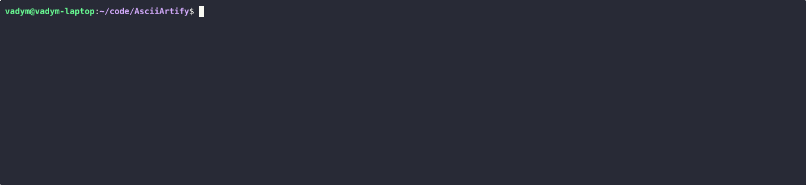

# Absract 
AsciiArtify seeking to define local development environemnt to support cureent and future development of the platrom they are building. 

Three major options for local development were analysed to meet the requirements. **Minicube**, **Kind**, and **K3d**.

The magor goal and main features defined by the projects maintiners.

## Minicube
Minikube is an official tool from the Kubernetes community designed to run a single-node Kubernetes cluster on your local machine. It aims to provide a full-featured Kubernetes experience

## Kind
Kind(Kubernetes IN Docker) is a tool for running local Kubernetes clusters using Docker containers as "nodes". It's primarily designed for testing Kubernetes itself, making it a highly conformant Kubernetes distribution.

## K3d
K3d is a lightweight wrapper to run K3s (Rancher Lab's minimal Kubernetes distribution) in Docker. K3s is designed for edge, IoT, and low-resource environments, and K3d leverages this by providing a very fast and efficient local Kubernetes experience.

# Feature Comparison
| **_Feature / Tool_** | **Minikube**                                            | **Kind**                                                  | **K3d**                                                                    |
|----------------------|---------------------------------------------------------|-----------------------------------------------------------|----------------------------------------------------------------------------|
| _Underlying Tech_    | VM, Docker container, Bare Metal (Linux)                | Docker containers as nodes                                | Docker containers running K3s (lightweight Kubernetes)                     |
| _Primary Usage_      | Full-featured local app development                     | Testing Kubernetes itself, CI/CD                          | Lightweight K8s for edge, IoT, dev, CI                                     |
| _Resource Usage_     | Higher (especially with VM drivers)                     | Moderate (Docker resources)                               | Very Low (K3s is optimized)                                                |
| _Startup Time_       | Slower (VM overhead)                                    | Fast                                                      | VEry Fast                                                                  |
| _Multi-Node Support_ | Available, but single-node is default/common            | Yes, excellent for HA                                     | Yes, easy to configure                                                     |
| _Multiple Clusters_  | Yes (via profiles)                                      | Yes                                                       | Yes                                                                        |
| _Add-ons/Features_   | Rich set of built-in add-ons (Dashboard, Ingress, etc.) | Focus on core Kubernetes conformance                      | Metrics server, integrates with K3s features (e.g., built-in LoadBalancer) |
| _Portability_        | Cross-platform (macOS, Linux, Windows)                  | Cross-platform (macOS, Linux, Windows)                    | Cross-platform (macOS, Linux, Windows, requires Docker)                    |
| _Persistence_        | Good, easy to stop/start without losing state           | Clusters are often ephemeral, but state can be maintained | Easy to stop/start without losing state                                    |

# Conclusion
My recomendation is to use **K3d** as fastest, less resorce hungry option. It support mulpiple OS and it has good multi-platform support. It unfortunatelly require Docker so we need to keep an eye to any future releases for Podman support.

**Note:** K3d does not support external IP for Load Balancers out of the box but service still can be accessed via kubernetes endpoint IP and node port on Load Balancer Service.

[Asciinema link](https://asciinema.org/a/rrdfPVZLN1JA14VjJ9JPVdDW7)